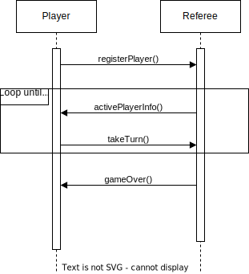

## Player Protocol

Created by Nathan Kirschner and Joseph Hirsch

The player-referee protocol has the following functions that occur in the given order.

1. registerPlayer()
   - Message sent from the player to the referee to register a player in a game
   - Player provides their age to be used for turn ordering
2. activePlayerInfo()
   - Message sent from the referee to the player to give them information need to make a turn
   - When a player receives this message it indicates that they are the active player
   - Gives the relevant information for the active player such as their id, the map state, their current tiles, number of remaining tiles that the referee has, scoreboard, and turn order
3. takeTurn()
   - Message sent from the player to the referee to take a turn
   - Indicates which type of turn the player wants to take, and includes relevant information such as tile placements
   - If the turn is invalid, the player receives no future responses from the referee
4. Repeat steps 2 and 3 for every active player until the game ends.
5. gameOver()

   - Message sent from the referee to the player indicating a game is over
   - Includes the final scoreboard for the game

### Sequence Diagram

