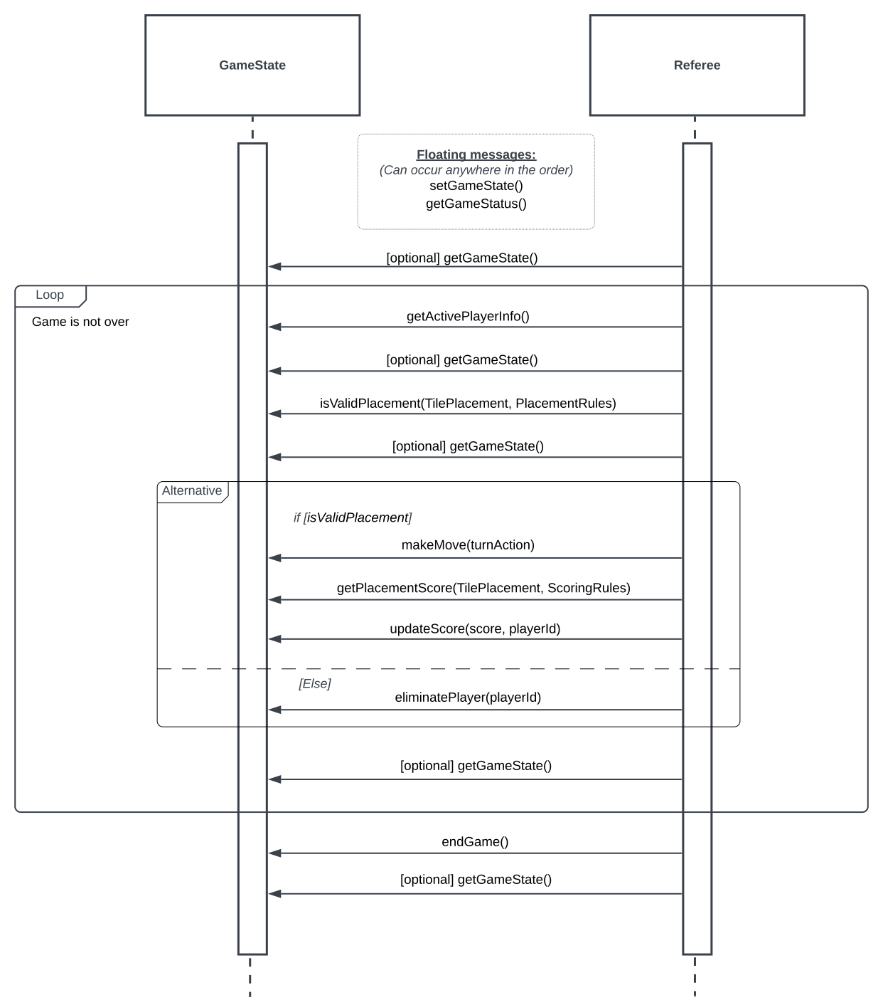

# Referee State

Created by Nathan Kirschner and Joseph Hirsch

### Game State Interface

```
// ---- Game State Interface ----
// ------    Methods    -------

// The GameStateData type includes all information about a game state, such as the players (with their ids), player scores, player tiles, map state, remaining tiles and their order, and turn order (with currently active player)

// Method to set the game state to the given state information
... setGameState(GameStateData) => void

// Method to get GameStateData, which can be used to resume the current game at a later time
... getGameState() => GameStateData

// Get the data a player needs to be given to make a turn
// The ActivePlayerData type includes information such as the map state, player turn order, the player's tiles, the number of remaining tiles, and the scoreboard
... getActivePlayerInfo() => ActivePlayerData

// Gets the current status of the game, which is either 'Finished' or 'In Progress'
... getGameStatus() => GameStatus

// Method to check if a placement is valid according to the given rules
... isValidPlacement(TilePlacement, PlacementRules) => boolean

// Prompts the referee to act out a turn on behalf of the active player
// The turn action specifies whether the move should be to pass, exchange all tiles, or place given tiles
// Changes the active player to next in the turn order
... makeMove(turnAction) => void

// Get the score that should be added for the given tileplacement according to the scoring rules
... getPlacementScore(TilePlacement, ScoringRules) => number

// Update the given players score
... updateScore(score, playerId) => void

// Remove the given player from the game
... eliminatePlayer(playerId) => void

// End the current game by setting the GameStatus to 'Finished'
... endGame() => void

```

### Referee - Game State Protocol

The Referee-GameState protocol has the following functions that occur in the given order. The documentation for these methods can be found in the `QGameState` interface in `src/gameState/gameState.ts`.

#### The following can occur at any time in the sequence of an active game, in order to save/resume a game state:

- `setGameState()`
- `getGameStatus()`

#### 1. (Optional) `getGameState()`

#### 2. `getActivePlayerInfo()`

#### 3. (Optional) `getGameState()`

#### 4. `isValidPlacement(TilePlacement, PlacementRules)`

#### 5. (Optional) `getGameState()`

#### 6. _Take turn:_

##### If placement from step 2 is valid:

- `makeMove(turnAction)`
- `getPlacementScore(TilePlacement, ScoringRules)`
- `updateScore(score, playerId)`

##### If placement from step 2 is not valid

- `eliminatePlayer(playerId)`

#### 7. (Optional) `getGameState()`

#### 8. Repeat steps 2-7 until game is over

#### 9. `endGame()`

#### 10. (Optional) `getGameState()`

### Sequence Diagram


