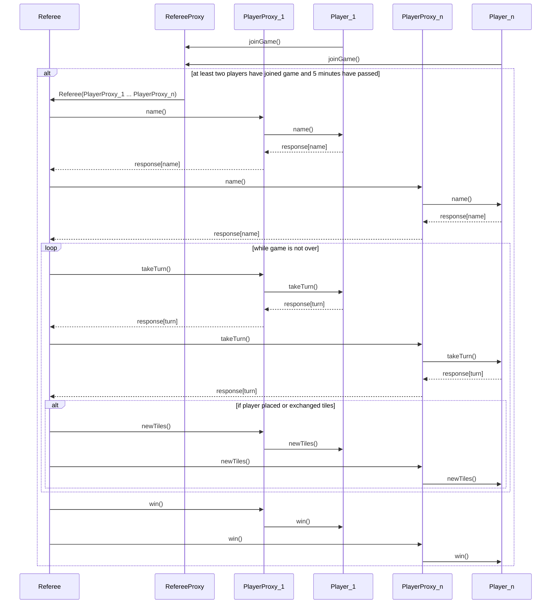

# Interactions between players and referee in a distrubuted system

## Summary

For the distributed system, we will need to define a new set of components to
handle communication over a network. For this purpose we have designed a
`PlayerProxy`, which acts as a mediator between the `Referee` on the server
machine and the `Player` which exists on the client machine. In addition, we
have designed a `RefereeProxy`, which allows `Player`s to join a game via a
component on the client side and gives the `Referee` a list of
`TCPPlayer`s to run the game with.

Once the system is running, the `Referee` will run the game with `Players` as it
would in the monolithic system, but under the hood it will actually be
interacting with `PlayerProxy`s, which in turn will be interacting with
`Player`s on the client. Conversely, the `Player` will respond to method calls
from the `Referee` as it would in the monolithic system, but under the hood it
will actually be responding to method calls from the `PlayerProxy` which will
itself return the results of the method calls to the `Referee`.

### PlayerProxy Definition

A `PlayerProxy` exists in two parts, a (`TCPReferee`) that lives on the
client side and a (`TCPPlayer`) that lives on the server side. The
two components communicate with each other over a network connection.
- `TCPPlayer` implements the `Player` interface and replaces the
  `Player` instances in the current monolithic system.
- `TCPReferee` interacts with the actual `Player` client instance.

### RefereeProxy Definition

Likewise, a `RefereeProxy` exists in two parts, a (`Client`) that
lives on the client side and a (`Server`) that lives on the
server side. The two components communicate with each other over a network
connection. 
- `Server` is a class which holds a list of `TCPPlayer`s
  which are looking to join a game.
- `Client` is a function which builds a `TCPReferee` and
  tells the `Server` that it should create a `TCPPlayer` on
  the server side and connect the two.  


## Game Launching

The players for a game are collected by the following process:
1. Players looking to join a game call the `Client` function, passing in a `Player`.
    - The `RefereeProxy` builds a `TCPReferee` and a `TCPPlayer`
      which exist to mediate interactions between the Referee and a Player across
      a network.
    - The `RefereeProxy` establishes a connection between the two `PlayerProxy` components.
    - The `RefereeProxy` then adds the `TCPPlayer` to a list of players
      which it maintains on the server.
2. Once the `RefereeProxy` has at least 2 players and at least 5 minutes have
   passed since the first player joined, the `RefereeProxy` calls `Referee` with
   the list of `TCPPlayer`s.
3. The `Referee` runs the game as it would in the monolithic system, but
   interacting with the `TCPPlayer`s instead of `Player`s.
    - `TCPPlayer`s appear to behave identically to local `Players`, but
      internally they translate method calls to json and send them to the
      `TCPReferee`, which translates the json back into method calls and
      calls them against the actual `Player` instance on the client machine.
    - Eliminated players' `TCPPlayer`s can be ignored as they are in the
      monolith system and the `TCPReferee` instances will simply not
      receive any more network requests.  
4. The game completes as normal, and the `Referee` calls `win()` on each
   `TCPPlayer` to notify them of the results of the game. 

### Network Protocol Communication
- The format for communication within the `PlayerProxy` and `RefereeProxy` components is
  JSON.

#### Client -> Server
- `Client` sends a JSON object to `Server` with the
  following format:

```
{
    method: "joinGame",
    args: [<TCPRefereeAddress>]
}
```
- _Where_ `<TCPRefereeAddress>` is a representation of the network
  information needed to connect to the `TCPReferee` instance on the
  client machine (includes address, port). This allows an instance of `TCPPlayer` to establish a network
  connection with a corresponding `TCPReferee` instance.

#### TCPPlayer -> TCPReferee

- `TCPPlayer` sends a JSON object to `TCPReferee` with the
  following format:
```
{
    player: <player name>,
    method: <method name>,
    args: [<arg1>, ..., <argn>]
}
```
- _Where_ `<player name>` is the name of the player that the `TCPPlayer`
  is representing. This allows the request to be directed to the correct `TCPReferee`.
- _Where_ `<method name>` is one of the following: `name`, `takeTurn`, `newTiles`,
  `win`.
- _Where_ each `<argi>` (1 <= i <= n) in the `args` array is a JSON representation of an argument
  passed to the method call. It is serialized using `JSON.stringify()` in order
  to make the objects valid JSON.
  - Since all arguments to methods in the `Player` interface are serializable,
    this should allow for arguments to be serialized and parsed without errors
    or the loss of any data.
  - After the `TCPReferee` receives the JSON arguments, it will parse
    them usingz `JSON.parse()` and build the corresponding objects to pass to a
    method of the `Player` instance.

#### TCPReferee -> TCPPlayer

- `TCPReferee` sends a JSON object to `TCPPlayer` with the
  following format:
```
{
    name: <player name>,
    method: <method name>,
    result: <result>
}
```
- _Where_ `<player name>` is the name of the player that the `TCPReferee`
  is representing. This allows the request to be directed to the correct `TCPPlayer`.
- _Where_ `<method name>` is one of the following: `name`, `takeTurn`, `newTiles`,
  `win`.
- _Where_ `<result>` is the result of the method call against the `Player`
  instance. Similar to above, it is serialized using `JSON.stringify()` and
  parse by the `TCPPlayer` using `JSON.parse()`. As with arguments, all
  return values from methods in the `Player` interface are serializable.

## Sequence diagram for running a distributed game
