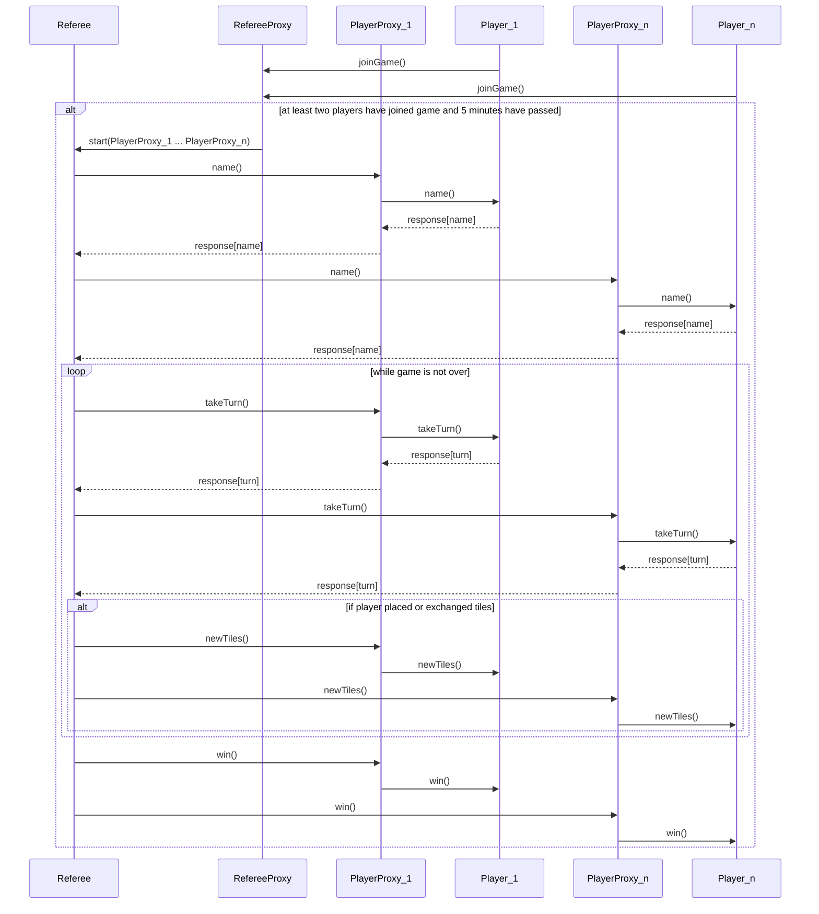

- Server needs to gather players
    - `Player` hits a `RefereeProxy` with `joinGame` which then triggers the
      referee proxy to build a corresponding `PlayerProxy`
    - If there are at least two players, after five minutes from the first
      player joining the `RefereeProxy` gives the `Referee` the list of
      `PlayerProxy`s, which implement the `Player` interface
- Launching (`takeTurn` and `newTiles`) a game and reporting result (`win`)

- TODO JSON communication (what do requests internal to proxies look like)
    - anything that goes through a proxy must be serializable
    - PlayerProxy for instance exists half on the server side and half on the
      client save 
        - server is method calls with data -> network requests with json
        - client is network listeners with json -> method calls with data

- things are translated to json in the proxy and then translated back on other
side of proxy
```
json type for tile:
{
    shape: 
    color: 
}

```