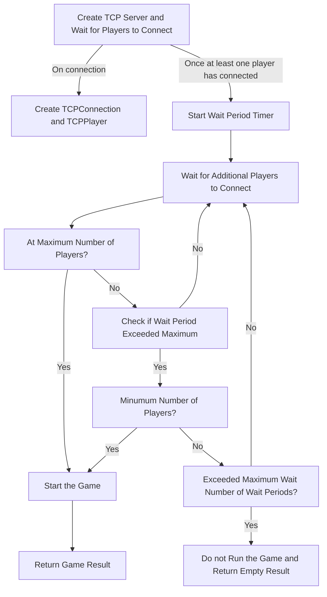
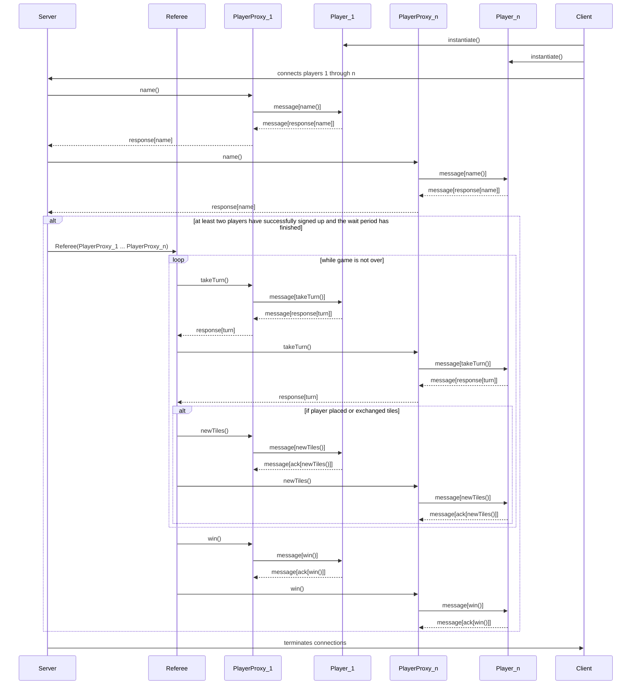

## REMOTE
This directory contains code related to running the Q Game over a network.

It contains 
- `connection.ts`, which abstracts the functionality of a TCP connection
  into a `Connection` class. It is used by both the server and the client to
  communicate with each other.
- `debugLog.ts`, which is a utility for optionally logging debug messages,
  depending on the value of `verbose` passed to its construction.

### Server

This directory contains code that is run on the server side of the networked game.

It contains:
- `server.ts`, which is the entry point for the server. It is
responsible for starting the server, waiting for clients to connect, and then
starting the game.
- `playerProxy.ts`, which contains a `TCPPlayer` which
  implements the player interface. It allows the referee to interact with the
  players controlled by clients as it would normally, because `TCPPlayer`
  translates those method calls into messages sent over the network.

#### Server Behavior

### Client

This directory contains code that is run on the client side of the networked game.

It contains:
- `client.ts`, which is the entry point for the client. It
  is responsible for creating players, connecting to the server, and then
  starting referee proxies for each player.
- `refereeProxy.ts`, which contains a referee proxy function
  which handles messages from the server and translates them into method calls
  to be made on a local client player instance. 

## Sequence Diagram for Running a Distributed Game
